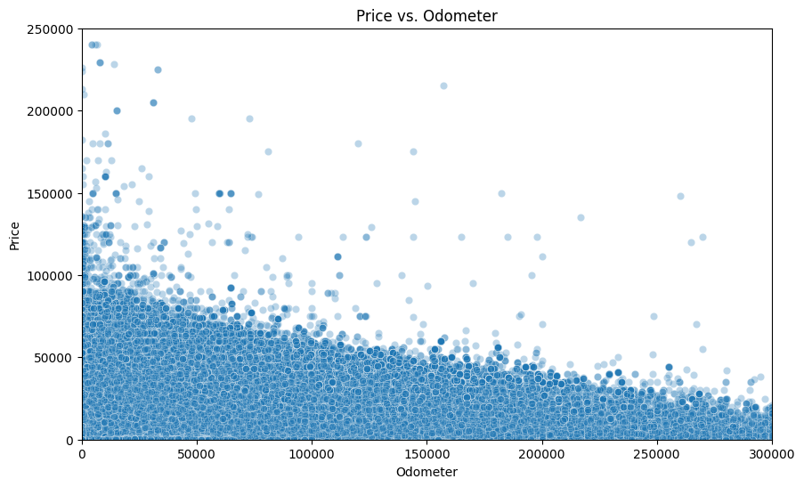
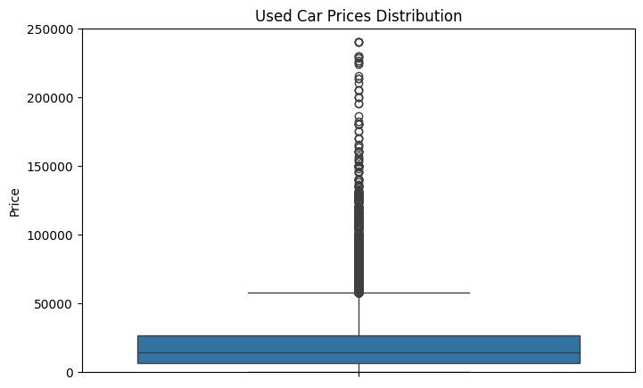
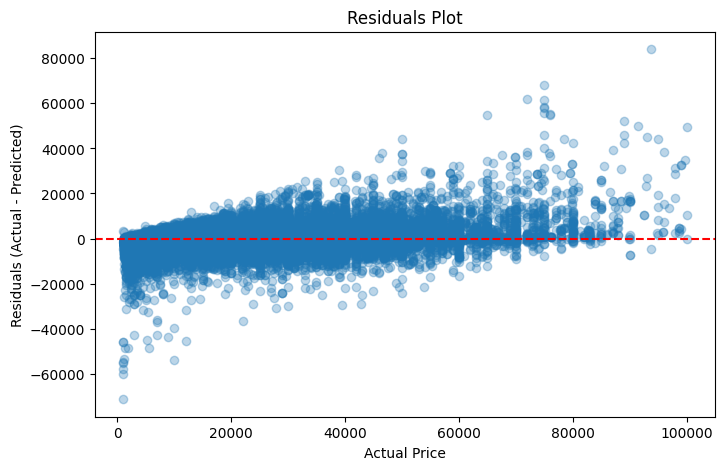
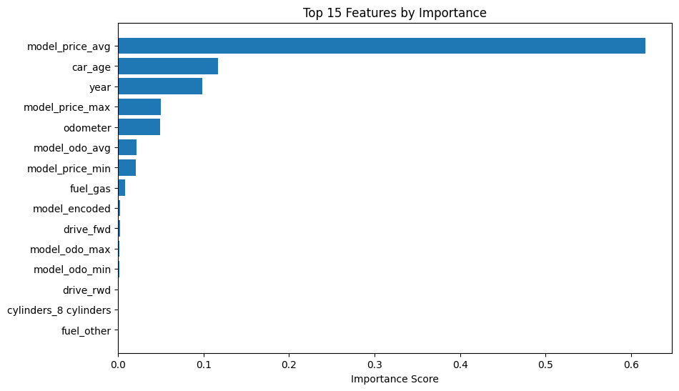
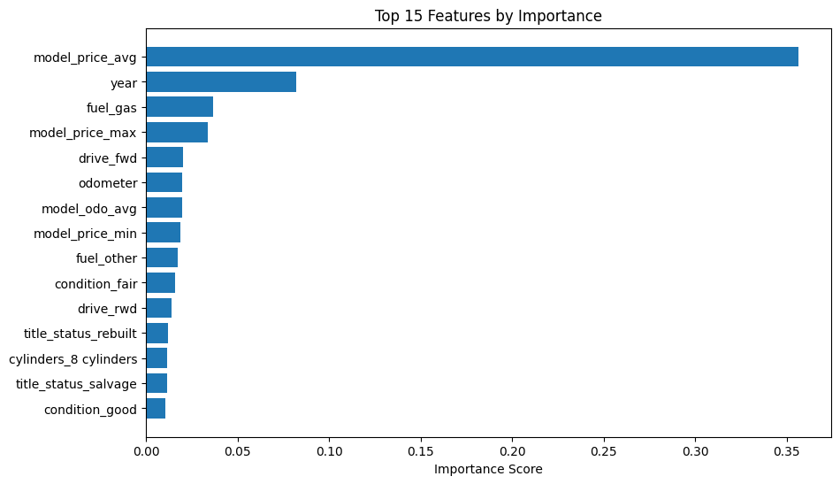

# What Drives the Price of a Used Car?

### Goal
This project explores the key factors that influence the resale price of used cars, using a dataset of ~426,000 listings.
The objective was to support a used car dealership in understanding what features consumers value most, and
to develop an accurate price prediction model to fine-tune pricing and inventory decisions.

This project was structured using the **CRISP-DM (Cross Industry Standard Process for Data Mining)** methodology, 
progressing through business understanding, data preparation, modeling, evaluation, and deployment phases.

**CRISP-DM Process Followed:**
- **Business Understanding:** Defined goals from a dealership pricing perspective.

- **Data Understanding:** Explored used car listings and identified key patterns.

- **Data Preparation:** Filtered, cleaned, and engineered impactful features.

- **Modeling:** Tested multiple regression models and tuned hyperparameters.

- **Evaluation:** Used cross-validation, residuals, and MAE/R² for assessment.

- **Deployment:** Outlined next steps for app integration and business use.

### Business Understanding
Used car dealerships rely on subjective judgement or fragmented data to set prices.
The goal of this project is to:

- Identify the strongest predictors of used car prices.
- Build a reliable, data-driven pricing model.
- Deliver actionable insights to guide procurement and sales.

### Data Understanding and Preparation
The dataset included attributes such as:
- Year
- Odometer
- Manufacturer
- Fuel Type
- Title Status
- Condition
- Transmission and more

Note:
- The `region` column was excluded from the final model due to its high cardinality and limited interpretability. 
  - Instead, broader geographic signals were captured using the state feature. 
  - Future work could incorporate regional economic data or aggregated `region_price_avg` values to improve geographic sensitivity.

**Key Preprocessing Steps:**
- Removed listings with unrealistic prices (< $1000 or >$100,000)
- Handled missing values with a mix of imputation and category simplification.
- Engineered new features:
  - `car_age`
  - Model-level price/odometer aggregates: 
    - `model_price_avg`, `model_price_min`, `model_price_max`, etc.

### Visualizations

- **Scatter Plot:** Price vs. Odometer to detect outliers
  
  - There's a clear negative trend in the scatter plot: as odometer (mileage) increases, car price tends to decrease.
  - However, there are many extreme outliers:
    - Some cars with very low mileage priced well above 100,000 - 200,000 dollars.
    - Others scattered up to $250,000, which is unrealistic for most used cars and can heavily skew model learning
    - At the same time, there's a cluster of low-priced entries (< $5,000) that might represent budget or non-functional vehicles.

- **Box Plot:** Price distribution by condition and manufacturer
  
  - The majority of cars are priced between $5,000 and $25,000, as indicated by the height of the  box (interquartile range, IQR).
  - There are numerous outliers above ~$55,000 — extending well beyond $100,000 and up to $240,000. These are likely:
    - Luxury vehicles
    - Improperly priced entries
    - Or rare, high-end models

- **Residual Plot:** Visual check of prediction errors
  
  - A residuals plot was used to assess prediction accuracy across the price range. 
  - Most residuals are clustered tightly around zero, indicating that the XGBoost model does not consistently over or under-predict. 
  - The spread increases at higher price points, which is expected due to greater variance in luxury or high-end vehicles. 
  - Overall, this visualization supports the model’s strong predictive performance and confirms that errors are random and not systematically biased.

- **Feature Importance Chart:** From Random Forest
  
  - After filtering out price outliers and focusing on relevant features, the Random Forest Regressor achieved a Mean Absolute Error of ~$4,350 and an R² score of 0.78, 
  indicating that the model can reliably predict used car prices.
  - This result confirms that features like `car_age`, `odometer`, `manufacturer`, `model_encoded`, and `condition` are strong predictors of resale value.
  - After feature engineering, Random Forest Regressor's performance plateaued with more estimators, indicating stability.

- **Feature Importance Chart**: From XGBoost
  
  - The feature importance analysis from XGBoost reveals that the most powerful predictor of a used car’s price is the _average market price_ of that model. 
  - This context-driven feature outperformed traditional indicators like `year` and `odometer`. 
  - Other engineered features like `model_price_max` and `model_odo_avg` provided additional insights, allowing the model to benchmark each vehicle within its model group. 
  - Traditional indicators like `mileage`, `drivetrain`, and `title_status` still contributed, but to a lesser extent. 
  - Overall, this shows that contextual model-level data significantly boosts pricing prediction accuracy.

### Modeling Approach
Evaluated 3 regression models:

| Model            | Mean Absolute Error (MAE) | R² Score | Comments                |
|------------------|--------------------------|----------|-------------------------|
| Ridge Regression | ~$4,841                  | 0.71     | Poor fit/under-fit.     |
| Random Forest    | ~$2,630                  | 0.90     | Strong. Solid Baseline. |
| XGBoost          | $2,140                   | 0.93     | Best performing model.  |

- **Evaluation Metric:**
  - **R² Score** - to explain variance
  - **Mean Absolute Error(MAE)** - to interpret pricing error in dollars.
- **Cross-Validation:**
  - 5-fold cross validation with a R² Score of 0.921 and low variance, indicating model robustness.

### Key Findings

- `model_price_avg` was the single most powerful predictor of price.
- `year` and `fuel_type` were strong secondary indicators.
- Feature importance from XGBoost confirmed that the engineered features significantly improved performance.

### Recommendations for Dealership

- Prioritize inventory of car models with,
  - **higher market average value and resale retention.**

- Incorporate model-level pricing benchmarks into trade-in and listing processes.
- Use a predictive pricing model to flag under or overpriced vehicles.

### Next Steps
- Integrate the trained XGBoost model into a simple dashboard for pricing managers.
- Explore real-time market data to refresh model-level price benchmarks.
- consider seasonal or location-based adjustments in future modeling.

### Project Files
| File                                                               | Description                               |
|--------------------------------------------------------------------|-------------------------------------------|
| [bhaiml_pract_app_02_.ipynb](notebooks/bhaiml_pract_app_02_.ipynb) | Full CRISP-DM analysis and model training |
| [vehicles.csv](data/vehicles.csv)                                  | Original dataset                          |
